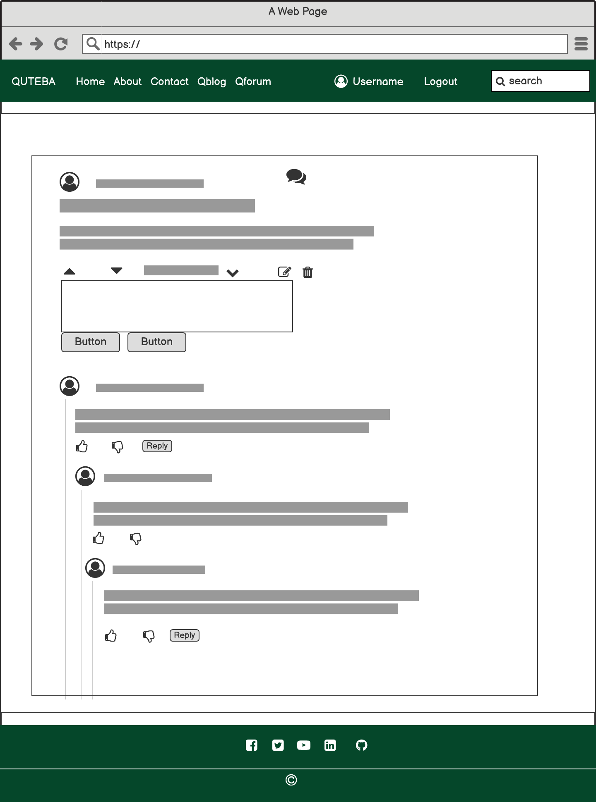
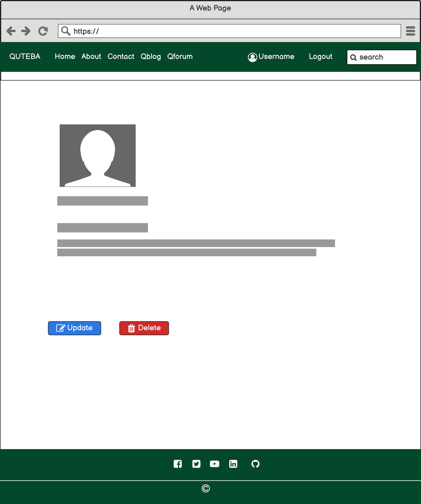
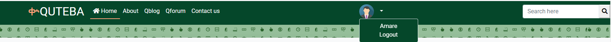

# QUTEBA
Quteba is a dynamic website that aims to serve the general public by providing views and analyses pertinent to economic issues as well as by enabling users to participate in discussion forums. Quteba got its name from a Tigrinya word that can roughly be translated as Economy. Quteba is as much a platform for user created content as it is source of information for those who want to read blog posts. Users can start discussion forums and engage in discussions by way of comments and replies.

Quteba was built using Django framework for the back-end and JavaScript (and Jquery), HTML and CSS (and bootstrap) for the front-end.  


[View Quteba live on Heroku](https://quteba.herokuapp.com/)

#

## Table of Contents
* [User Experience Design (UX)](#UX)
    * [The Strategy Plane](#The-Strategy-Plane)
        * [Site Goals](#Site-Goals)
        * [Epics](#Epics)
        * [User Stories](#User-Stories)
    * [The Scope Plane](#The-Scope-Plane)
    * [The Structure Plane](#The-Structure-Plane)
        * [Opportunities](#Opportunities)
    * [The Skeleton Plane](#The-Skeleton-Plane)
        * [Wireframes](#Wireframe-mockups)
        * [Database Schema](#Database-Schema)
    * [The Surface Plane](#The-Surface-Plane)
* [Features](#features)
    * [Existing Features](#existing-features)
    * [Future Enhancements](#future-enhancements)
* [Technologies Used](#technologies-used)
* [Testing](#testing)
* [Deployment](#deployment)
* [Credits](#credits)

## UX Design

### The Strategy Plane
 
#### Site Goals

* Owner goals: 
   * The goal of the website is to provide a platform for users to discuss and understand relevant economic issues. Quteba has a dual purpose: for the average user, it is a place where they can ask questions and get answers from other users. For users who are looking for deeper analyses from experts, quteba has a blog where contributors post articles and users can read, comment on or even open a discussion forum if they will.

* User goals: 
   * Users of Quteba are interested in either getting quick answers to specific questions or a deeper insight on a given problem. As such, they want to engage in discussion forums by asking questions, reading comments, replying and/or reacting to the comments and replies others provide. Users are also interested in grasping the various viewpoints on specific economic topics, and thus they want to read articles that synthesize different theories and pieces of information.

#### Epics
In this project, the following 8 epics were created which encapsulate the user stories below.

- Useability
- User authentication
- User profile  
- Quteba blog 
- Quteba forum
- Nested threads
- Search for content
- User interaction 

#### User Stories

The above user goals and epics were decomposed into user stories that helped me to identify and implement specific features. The user stories and different tasks under them were listed in the project kanban board to keep track of the status of each feature. 

- Useability
   - As a first time visitor I want to get information about the site so that I can understand the what the site focuses on and how I can make the best out of it.
   - As a first time visitor, I want to be able to navigate the site so that I can find the most important information with the least amount of effort.
   - As an engaged user, I want to see relevant feedback so that I can understand if my interactions with the site are successful or not. 
   - As a user, I want to know which menu item is active so that I can know which part of the site I am navigating at each moment. 
   - As a user, I want to be able to access quteba's contents and functionalities from my mobile or tablet so that I do not have to wait until I find a computer.
   - As a frequent user, I want to follow the site owner on social media so that I can see recent activities and updates from my favourite social media apps.

- User authentication
   - As a first time visitor I want to sign up so that I can have login credentials which I can use to login to the site every time I want to use it. 
   - As a registered user, I want to be able to login with my registereg credentials so that I can access my profile as well as all the contents and functionalities that require that users be logged in.
   - As a logged in user, I want to be able to logout easily so that I feel safe that others do not interact with the site via my account.

- User profile 
   - As a registered user I want to have a profile so that I can choose a profile picture and share my bio with other quteba users.
   - As a registered user I want to update and delete my profile so that I have control of what I want to do with my personal information.

- Quteba blog
   - As a reader I want to read excerpts of blog posts so that I choose which articles to read without going through the whole content of each post.
   - As a contributor I can create drafts and publish posts without entering the admin page so that I can quickly share my views and analyses with readers.
   - As a regular reader, I want to read the contents of each post on its own page so that I can focus on the contents of the specific post at a time while being able to see other users' feedbacks to the particular post.
   - As a registered user I want to like posts and add comments so that I can express my impression and engage in a discussion.

- Quteba forum
   - As a first time visitor I want to see sample forum entries so that I can decide if I want to join the discussions. 
   - As a registered user, I want to create a discussion forum so that I can get answers to my questions and start conversations.
   As a user, I want update or delete my own discussion forum so that I can opt out from a conversation that takes a different direction from I initially intended.
   - As a frequent user, I want to vote up or vote down a forum so that I can quickly reward or punish contents based on their importance and relevance without having to write comments. 
 
- Nested threads
   - As a dedicated user, I want to reply to comments on a forum I created so that I can open and lead an engaging conversation on relevant topics. 
   - As a registered user, I want to leave comments on discussion forums so that I can express my views and lead to further discussions.
   - As a frequent user, I want to like or unlike comments and replies to express my opinions of them without having to write comments or replies.
   - As a registered user, I want to reply to other users' comments and replies so that I can follow the threads and identify the forkroads that emerge from the discussions.
   - As a forum reader, I want to see nested threads of forum topics, comments and replies so that I can visually see which replies are given to which comment.

- Search for content
   - As a user, I want to search for specific content so that I can find quick answers to the questions I have in mind.
   - As a user, I want to see excerpts of my search results so that I can quickly identify the most relevant content I want to read further.

- User interaction
   - As a user, I want to interact with the site smoothly so that I can see the effect of my actions without refreshing the pages.  
   - As a user I want to contact the site admin directly so that I can ask questions and send comments to get clarifications and to express my opinions and expectations.

### The Scope Plane
#### Functional specifications
When Quteba was built, the following set of features was planned.
- User registration, login and logout features
- Reading, updating and deleting user profile
- Reading blog posts, creating comments and likes
- Create, read, update and delete forums
- Add comments and replies
- Vote forums up or down, like or unlike comments and replies
- Search blogs and forums
- Create contact messages 
#### Content requirements
Quteba presents two types of contents: blog posts created by users with permission to do so or with the help of admin and forums created by users who only need to be logged in. Comments on blog posts will be moderated by site admin to make sure that only relevant comments are visible. Logged in users will be able to add comments and replies, like in social media platforms such as Facebook. The scope of moderation in this feature is limited to the admin's ability to remove comments if need be there. A reporting mechanism can be added as a future enhancement so that users can report offensive or irrelevant comments so that the admin can delete them.
### The Structure Plane
The dual purpose of Quteba, blog and forum, needs to be made obvious to the user from the outset. First time visitors should land on the home page where they see the main menu, a call to action invisiting new users to create account and registered users to sign in. Links to and brief descriptions of Qblog and Qforum should presented in the same view port on medium to large sized screens.
- First time users should be able to see static information about Quteba. The about page is accessible from the menu bar. 
- To enable users to contact quteba without having to create an account, the contact page should be available to all users and be accessible from and with a single click on the menu bar.
- User registration should be easy and intuitive. The menu bar and the home page should have links to the sign up page. The same applies to user login. Users should be able to see the signup or signin page with a single click on the relevant and intuitively labeled link.
- The home page features Qblog and Qforum, links which should take the user to the respective sections in the home page. A pen icon should be used for Qblog to indicate that the content is written text. The icon on Qforum should reflect that one expects a community of users in the forum.
- Qblog should be linked to the Recent Posts section where any user can read the titles and excerpts of three recent posts. Then users can be invited to sign up or signin to access all blog posts.
- Qforum should be linked to the Recent Forums section where any user can read three of the most recently created forums, not the entire thread. Then users can be invited to sign up or signin to access all threaded forums.
- A footer with social links that open in new tab should be presented at the bottom of each page. A copyright section in the footer should be used to link the home page so that users can always click it and go back to the home page.
- Progressve disclosure: When a user is logged in, the home page should still show the featured Qblog and Qforum links and sections. The menu bar will now show links to the entire lists of blog posts and forums as well as the user's profile image and username linked to the profile page.
- User profile: Once a user is logged in, they should be able to read, update and delete their profile. These features should be accessible from the profile page which should be only a click away from the menu bar.
- Blog list: While the home page displays three of the most recent posts, the entire list of blog posts should be shown in a dedicated page. This page should open with a single click on the Qblog menu item in the menu bar.
- Blog detail: While the blog list gives users the ability to have a quick glance at the title and excerpts to decide whether to continue reading a particuar post or not, the whole content of the post should be displayed on a separate page. This page should open with a single click on the post title in the blog list page.
- Forum list: The forum list page should present the list of forums so that users can pick the topics they like. Once they decide which forum to read, they should click only once to see the entire thread.
- Thread: A thread is a single discussion forum topic and all comments and replies under it. Each forum should have its own page so that users can stay focused on the topic while reading other people's comments and adding their own comments and replies.
- nested comments: Quteba's users are likely to be familiar with most social media platforms. Presenting Qforum in a nexted forum-comments-reply structure with familiar icons for likes and unlikes will help the user leverage their experience in social media such as Facebook.
- Dual search: To provide users with what they want, a search feature should be added to the menu bar so that a user with specific concepts in mind can enter a search word and see results quickly. The search should be performed on both the blog and forum databases simultaneously so that the user will have more options. 
### The Skeleton Plane
#### Wireframes
- Home page: First time users want to learn about quteba and its contents. The home page presents links to the about page while featuring Qblog and Qforum. After showing three blog posts and three forum entries, the user is invited to sign up or sign in to unlock the whole content. The home page has several places where the user is nudged to create account and login: menu items in the menu bar, first section in the home page and each of the Qblog and Qforum sections.


- Qblog: Logged in users can easily navigate to Quteba Blog (Qblog) by using the menu bar or the button on the Recent Posts section of the home page. Qblog lists all blog entries displaying only title, author, date and excerpts of each post. The most recent entries are shown first. 


- Qforum: The Forum list page allows users to read forums and create forums. The purpose of listing all forum entries without the comments and replies under them is to help the user choose a topic that is of interest to them before spending time reading the whole thread of each forum. If a user visits this page with the intension of asking a question or starting a conversation, they can create a forum directly. Each forum also shows the number of comments and replies in the thread as well as the number of up and down votes. 


- Threads: A thread is a single forum and its comments and replies. It is nested in that the forum being at the top of the page, it can have multiple comments each with the possibility of having multiple replies and replies to replies and so on.
A logged in user can comment on a forum, reply to comments and other replies (except one's own), vote up or down on a forum and like or unlike a comment or a reply.



- Profile: Registered users can login and read their profile information in a dedicated profile page. The profile page has buttons which enable the user to update their profile information including their profile picture or delete their profile. 




#### Database Schema

The ERD tool in postrgresql pgadmin 4 was used to generate the Entity Relationship Diagram for the data models. 

ERD for the user, profile, blog post, forum category and thread models.


### The Surface Plane

#### Typography


#### Colors

A deep green (British Racing Green) color, which is a calming color, with varying intensity.
To create a good contrast, I used white text on a deep green background.


Bootstrap colors primary (for blue) and danger (for red) are used in buttons, the latter being associated with delete buttons. Light salmon was used to make the logo stand out in the deep green background color of the navbar. 

## Features

### Existing Features

* Quteba serves the aforementioned user stories by providing two broad features: Quteba Blog (Qblog) and Quteba Forum (Qforum). Besides these, it has static pages. 

* **Homepage:** Quteba's homepage provides first time users with information and links that helps them navigate the website easily. With first time visitors of the site in mind, the dual purpose of the site is made clear from the outset. Users see links to and information about Qblog and Qforum. There is a nav bar at the top which presents different menu items, so users can choose with a single click to view what quteba is about, a sign up page or if they have an account a sign in page.

The home page also presents the most recently added blog entries and the active discussion forum topics in separate sections. This gives users the chance to have a quick glance at what kinds of topics and questions are being discussed. From users' perspective, this preview is important because it gives them an idea of what to expect before delving into the whole list of either Qblog or Qforum.

* The navigation menu: This is visible in the home page and all other pages. Only some of the items in the menu change depending on whether the user is logged in or not.


* Authenticated users see links not only to Qblog and Qforum but also to their profile page.



* **Search form:** Users who are looking for a particular concept may search for it by typing a keyword in the search input form at the top bar of each page. If the keyword exists in Qblog and/or Qforum, the results are displayed in a separate search results page.

  


* **Search results page:** This page renders the search results when a user searches for a specific keyword and a matching entry is found in either Qblog or Qforum or both. If the keyword the user types in the search form does not exist, the results page shows a feedback message. 

* **About page:** the about page is a static page that gives users important information about the background and services of quteba.

* Users who come across quteba for the first time can read the about page and learn what quteba means and holds. 

* **Qblog:** Qblog lists blog entries showing the author, title, date and excerpts of each blog post. The title is clickable and linked to the blog detail page. By viewing only the list of blog posts, users need not read each blog before they find what they want to read. The excerpts will give users enough information to help them decide whether to continue reading or find another article. There is also a button next to the excerpt which is linked to the details page.

* Blog detail page: The blog detail page shows users the title of the article, author, date, content, likes and comments (if any).
Logged in users also see a form where they can type and submit a comment.
 
* **Qforum:** The purpose of having the Qforum on the menu bar and a list of forum entries (thread list) is similar to that of Qblog. Users can click on the Qforum menu item and land on a page that lists discussion forums. As each forum has a topic and description (question text), users can get an idea of what a particular discussion forum is about. 

* Here we clarify some terminologies. Forum and thread are used interchangeably. When a user creates a new discussion forum, the topic, description and the comments and replies under it are all part of a discussion forum. The comments and replies make a thread.
* **Categories:** we use categories to refer to broad areas of economics that encapsulate the particular discussion topics. For example, a category can be Finance while the discussion topics may relate to specific concepts such as exchange rate.

* The Qforum page has a form for users to submit questions. It is placed at the top but users need to click and expand it. This is efficient because the form does not cover the most central part of the page for users who are interested in reading the forums. It is also intuitively self-evident that a user should click it to create a forum.

* Qforum lists forums based on the date they were created, starting with the most recent ones. users can see how many comments and replies have been given under each discussion forum. 
(How to use vote counts to sort forums.)

* The forum list page has a sidebar that shows the most active topics. These are topics that have the most recent comment or reply.

* **Forum detail page:** When a user clicks on a particular discussion forum topic in the Qforum list page, a separate page with the particular forum at the top and any comments and replies under it. 
A user can edit or delete their own discussion forum and reply to comments and replies except their own. To this effect, the buttons a user sees in this page vary depending on whether the user is logged in or not and if the entries are their own or those of others.

* **Sign up page:**
New users are encouraged to sign up so that they can not only read what others have written but also engage in conversations by creating forums and through comments and replies. Users who decide to sign up at the very beginning will see the sign up menu item, which is also available throughout the quteba pages. Users who want to explore the contents first can do so until they try to add a comment, for example, where they will see a link to the login or sign up pages. 

* **Sign in Page:**
If a user has an account, they can login so that they can interact with Quteba in more ways than they otherwise would. A logged in user can add comments to blog posts, like blog posts, create a discussion forum, comment on a forum, reply to comments, vote up or down on forums, like or unlike replies, edit or delete their own forums and comments, update and delete their profiles.


* **Profile page:**
When a user logs in, they see their profile picture and their name on the menu bar. By clicking on their profile name, they can view their profile which has two buttons linked to (1) profile update form and (2) profile delete page. 

* **Update profile:**
The profile update page enables users to edit and update their profiles. The user can change their profile picture and update their bio. When they save the changes, they are redirected to the profile page.

* **Delete profile:**
If a user wants to delete the profile they created, they can do so by using the link provided in the profile view page. To make sure that a user does not suddenly delete their profile, the user gets a prompt asking the user if they are sure that they want to delete the profile. Only when they confirm will the profile be deleted. If the user does not want to continue with the deletion of the profile, they can cancel the process in the confirmation page and go back to the profile view page. 

* **Sign out page:**
When a logged in user wants to sign out, they can do so by clicking on the sign out menu in the navigation bar. They can sign out from any page because the navigation bar is available on all pages.
Once they click on sign out, they are asked to confirm that they logout. If the user does not want to complete the process, they can cancel it and go back to the (profile page).

* **Footer:**
The footer section is displayed at the bottom of each page to help users follow the social links or click on Quteba in the copyright section to go back to the home page. The social links open in new tabs.


* **User Interaction:**
One of the key principles of Quteba is user engagement. Users can create discussion forums which can grow in to a big threaded forum with many contributors. Users can also express their views by using likes and unlikes, up and down votes etc. As such, quteba becomes what its users make it to be. 
  - Create a forum: Logged in users can create a forum using the create forum form. They choose a category from a given list of categories, enter a topic and wrote a description of the issue they want other quteba users to address. On submitting the forum, an ajax call handles the backend interaction and the user sees the forum they just created without a page reload. This gives the user a good user experience. 
  - Comment: Comments and replies are technically the same. The only difference is that a comment is the direct child of a forum while a reply follows a comment or another reply. A forum, its comments, replies to comments and replies to replies create a nested tree. Users can add comments to forums by using a comment form modal that pops up when a user clicks on the comment button which displays a down arrow to hint that a click on the button opens a form. Users can edit or delete comments that they created.
  - Reply: As mentioned above, a reply is just a comment on a comment or another reply. Users see the same form when they subit a comment as when they write a reply. In this implementation, users cannot edit or delete replies because they can add another reply and explain themselves further while keeping their original opinion. 
  - Like/unlike a comment/reply: For users who want to express their views with a minimal effort, each comment as well as reply has like and dislike features. A logged in user can like a comment or a reply, or dislike a comment or a reply. 
  - Up/down vote a forum: The voting feature is added only to forums. A user who likes or dislikes a thread (a forum and the comments and replies thereof) can vote up or down respectively. While this captures the user's opinion about the whole issue in a particular forum, it is possible to use the votes as a basis for ranking forums such that forums with highest number of positive votes are, for example, featured in the landing page.
A common characteristic of these modes of user interactions are that they use ajax calls to make the user experience smooth. For the likes and dislikes, one can only like or dislike, but not both, at a time. The same applies to votes: if one has voted up and click on vote down, the up vote is removed and the down vote increases by one.

### Future Enhancements
    - Email notifications
    - Ability to view others' profiles and follow them
    - Ability to filter content by category and other criteria
    - Ability to use audio and video in the forum

## Technologies Used
# 

This project requires the use of Full Stack Tools. Django was used for the backend and JavaScript, HTML and CSS for the front-end. Postgresql was used for the database and psycopg2 was used as an Object Relational Mapper (ORM) tool. Below is a [list of all the technologies](https://github.com/Amareteklay/quteba/blob/main/requirements.txt) used in this project.
- ### Languages:
    + [Python 3.8.5](https://www.python.org/downloads/release/python-385/): the primary language used to develop the server-side of the website.
    + [JS](https://www.javascript.com/): the primary language used to develop interactive components of the website.
    + [HTML](https://developer.mozilla.org/en-US/docs/Web/HTML): the markup language used to create the website.
    + [CSS](https://developer.mozilla.org/en-US/docs/Web/css): the styling language used to style the website.
- ### Frameworks and libraries:
    + [Django](https://www.djangoproject.com/): python framework used to create all the logic.
    + [jQuery](https://jquery.com/): was used to control click events and sending AJAX requests.
    + [jQuery User Interface](https://jqueryui.com/) was used to create interactive elements.
- ### Databases:
    + [PostgreSQL](https://www.postgresql.org/): the database used to store all the data.
- ### Other tools:
    + [Git](https://git-scm.com/): the version control system used to manage the code.
    + [Pip3](https://pypi.org/project/pip/): the package manager used to install the dependencies.
    + [Spycopg2](https://www.python.org/dev/peps/pep-0249/): the database driver used to connect to the database.
    + [Django-allauth](https://django-allauth.readthedocs.io/en/latest/): the authentication library used to create the user accounts.
    + [Django-crispy-forms](https://django-cryptography.readthedocs.io/en/latest/): was used to control the rendering behavior of Django forms.
    + [Heroku](https://dashboard.heroku.com/): the hosting service used to host the website.
    + [GitHub](https://github.com/): used to host the website's source code.
    + [VSCode](https://code.visualstudio.com/): the IDE used to develop the website.
    + [Chrome DevTools](https://developer.chrome.com/docs/devtools/open/): was used to debug the website.
    + [Font Awesome](https://fontawesome.com/): was used to create the icons used in the website.
    + [Coolors](https://coolors.co/202a3c-1c2431-181f2a-0b1523-65e2d9-925cef-6b28e0-ffffff-eeeeee) was used to make a color palette for the website.
    + [BGJar](https://www.bgjar.com/): was used to make a background images for the website.
    + [W3C Validator](https://validator.w3.org/): was used to validate HTML5 code for the website.
    + [W3C CSS validator](https://jigsaw.w3.org/css-validator/): was used to validate CSS code for the website.
    + [JShint](https://jshint.com/): was used to validate JS code for the website.
    + [PEP8](https://pep8.org/): was used to validate Python code for the website.
    + [Cloudinary](https://cloudinary.com/): the image hosting service used to upload images and other media.
    + [Techsini](https://techsini.com/multi-mockup/index.php): to generate mock up for responsive design for various screen sizes.
    + [Balsamiq Cloud](https://balsamiq.cloud/) to create wireframes.


## Testing
# 

Detailed testing and test results [are documented here](TESTING.md).
### Bugs
- I created user stories in Github and django project in Gitpod. When I tried to push my local changes, I got an error which i fixed using [this solution](https://docs.github.com/en/get-started/using-git/dealing-with-non-fast-forward-errors).

- I was not able to deploy the application to heroku because of an error in backports.zoneinfo which ended up in the requirements file. I removed it manually and it worked. 
- I was not able to login to the admin page and got CSRF error. I added CSRF_TRUSTED_ORIGINS


## Deployment
# 

Quteba is deployed using Heroku and live at [quteba.herokuapp.com](https://quteba.herokuapp.com/).
### Deployment to Heroku

The following steps are followed to deploy the website to Heroku.
1. Create an account and Login to [Heroku](https://www.heroku.com/).
2. Create a new app on Heroku using the following steps.
    - Go to your Heroku dashboard.
    - Click on the "New" button.
    - Click on the "Create new app" button.
    - Give your app a name, e.g., Quteba.
    - Choose your nearest region.
    - Click on the "Create app" button.
3. In your app go to the "Resources" tab.
    - Add a Heroku Postgres database.
4. In your app go to the "Settings" tab, press "Reveal Config Vars", and add the following config vars or check if they are already added.
      - `DATABASE_URL` = The URL of the database provided by Heroku Postgres.
      - `SECRET_KEY` = The secret key for your Django project.
      - `CLOUDINARY_CLOUD_NAME` = Your Cloudinary Cloud Name.
      - `CLOUDINARY_API_KEY` = Your Cloudinary API Key.
      - `CLOUDINARY_API_SECRET` = Your Cloudinary API Secret.
      - `DEBUG` = True during development, False during production.
      - `DISABLE_COLLECTSTATIC` = Set to `1` to disable collectstatic during the development.
    
     *Note that you should change the DEBUG config var to False and remove the DISABLE_COLLECTSTATIC config var from the config vars on heroku after completing the development.*

    - To get cloudinary cloud name, api key, and api secret:

        - Go to the Cloudinary [website](https://cloudinary.com/).
        - Create an account, or log in to your account if you already have an account.
        - Go to the Cloudinary dashboard.
        - At the top of the page you will see your cloud name, api key, and api secret.
        - Copy these values and paste them into the config vars on heroku and into your env.py file.

5. In your app go to the "Deploy" tab.
  - Using GitHub:
      - Connect your Heroku account to your GitHub account and then click on the "Deploy" button. 
      - You can enable automatic deployment. 
      
  - Using Heroku CLI: 
      - Go to your local repository
      - Login to your Heroku account in your terminal and connect your local repository to your heroku app.
          ```
          heroku login -i
          ```
      - Enter your Heroku credentials.
      - Enter the following command to connect your heroku app and your local repository.
          ```
          heroku git:remote -a <your-heroku-app-name>
          ```
6. Create a Procfile.

7. Create requirements.txt. This can be done by running the following command:
          ```
          pip freeze > requirements.txt
          ```
8. Add and commit all changes.
9. Push your changes to Heroku.
    ```
    git push heroku <master or main>
    ```
10. Check the logs of your app in the Heroku dashboard for potential errors or click on the "Open app" button to see your deployed site.

### Local Deployment
#### How to Fork

To fork the repository:

1. Log in (or sign up) to Github.
2. Go to the repository for this project, [Quteba](https://github.com/Amareteklay/quteba).
3. Click the Fork button in the top right corner.

#### How to Clone

To clone the repository:

1. Log in (or sign up) to GitHub.
2. Go to the repository for this project, [Quteba](https://quteba.herokuapp.com/).
3. Click on the code button, select whether you would like to clone with HTTPS, SSH or GitHub CLI and copy the link shown.
4. Open the terminal in your code editor and change the current working directory to the location you want to use for the cloned directory.
5. Type 'git clone' into the terminal and then paste the link you copied in step 3. Press enter.


## Credits
# 

- I followed [this tutorial](https://replit.com/talk/learn/DjangoPython-and-HTML-Coding-Campus-Tutorial-1-Create-a-Blog-with-Django/142238?order=new) to create blog posts.

- Image for UX and behavioral economics was taken from [this webpage](https://startupsmagazine.co.uk/article-behavioural-economics-tips-ux-design).

- Template for forum was taken from [this page](https://www.bootdey.com/snippets/view/bs5-forum-list)
- I used the articles and code in [this page](https://www.devhandbook.com/django/user-registration/) to create user registration and profile.

- I began the blog list page by borrowing code from [this](https://replit.com/talk/learn/DjangoPython-and-HTML-Coding-Campus-Tutorial-1-Create-a-Blog-with-Django/142238?order=new) and [this](https://github.com/Code-Institute-Solutions/Django3blog/blob/master/10_likes/templates/index.html), which i later changed substantially.

- I took the data model for the forum from [this article](https://vertabelo.com/blog/database-model-for-an-online-discussion-forum-part-1/).
- I followed [this tutorial](https://focusustech.com/blog/create-a-comment-and-reply-system-in-django) to modify forum views and templates.
- I followed [this tutorial](https://learndjango.com/tutorials/django-search-tutorial) to implement search functionality.
- I used [this online converter](https://svgtopng.com/) to generate png from svg, which was created using [bgjar](https://bgjar.com/).
- Nav bar and footer background color was inspired by [this](https://www.mp.se/goteborg/just-nu/goteborg-ska-vara-en-karnvapenfri-zon/).
- I copied and edited the deployment procedure from our [hackathon project readme]().
- Code for user registration and signals was adapted from [this](https://www.devhandbook.com/django/user-registration/) and [this](https://www.devhandbook.com/django/user-profile/).


### Acknowledgements
# 
I have learnt from [Daisy](https://github.com/Daisy-McG), my mentor at the Code Institute, many ways to make this project better. Her valuable comments have enhanced the quality of this website a lot. Thank you [Daisy](https://github.com/Daisy-McG)! 

# 

#### [BACK TO TOP](https://github.com/Amareteklay/quteba#readme)