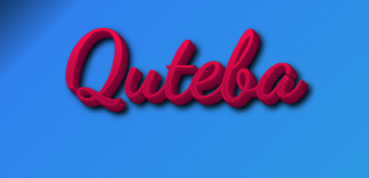

# QUTEBA
Quteba is a Tigrigna word for Economy. I have created Quteba as a dynamic website that serves readers with news and analyses pertinent to economic issues.

Quteba is a dynamic website created using Django framework for the back-end and HTML, CSS and frameworks thereof for the front-end.

[View Quteba live on Heroku](https://quteba.herokuapp.com/)

#

## Table of Contents
* [User Experience Design (UX)](#UX)
    * [The Strategy Plane](#The-Strategy-Plane)
        * [Site Goals](#Site-Goals)
        * [Epics](#Epics)
        * [User Stories](#User-Stories)
    * [The Scope Plane](#The-Scope-Plane)
    * [The Structure Plane](#The-Structure-Plane)
        * [Opportunities](#Opportunities)
    * [The Skeleton Plane](#The-Skeleton-Plane)
        * [Wireframes](#Wireframe-mockups)
        * [Database Schema](#Database-Schema)
    * [The Surface Plane](#The-Surface-Plane)
* [Features](#features)
* [Future Enhancements](#future-enhancements)
* [Technologies Used](#technologies-used)
* [Testing](#testing)
* [Deployment](#deployment)
* [Credits](#credits)

## UX Design
## Agile process
The Agile approach was key to the successful completion of this project. I started by creating user story template on Github. I used this template to generate user stories and plan their implementation. 

### The Strategy Plane

#### Site Goals

The goal of the website is to provide a platform for users to discuss and understand relevant economic issues. Quteba has a dual purpose: for the average user, it is a place where they can ask questions and get answers from volunteers. For users who are looking for deeper analyses from experts, quteba has a blog where contributors post articles and users can read, comment on or even open a discussion forum if they will.

Users of Quteba are interested in either getting quick answers to specific questions or a deeper insight on a given problem. As such, they want to engage in discussion forums by asking questions, reading comments, replying and/or reacting to the comments and replies others provide. Users are also interested in grasping the various viewpoints on specific economic topics, and thus they want to read articles that synthesize different theories and pieces of information.

#### Epics

#### User Stories
- As a **contributor** I can **create a profile and have my articles listed under my name** so that **readers can follow, read and engage in my work**
- As a **website user** I can **ask questions and send comments to the site owner** so that **I can get clarifications and express my opinions**
- As a **site admin** I can **verify authors and approve comments** so that **only relevant and engaging content is shared among readers**
- As a **reader** I can **follow and share latest activities on social media** so that **I see updates from a social media app I am using**
- As a **reader** I can **filter and set alert for content in different categories** so that **I do not have to read every article before I find the ones I am interested in**
- As a **reader** I can **like or unlike posts and comments** so that **I express my reaction without writing comments**
- As a **subscriber** I can **receive email notifications of new articles** so that **stay updated on relevant economic issues**
- As a **reader** I can **leave comments and view thread** so that **I become engaged in a conversation on a topic of my interest**
- As a **contributor** I can **create drafts and publish articles** so that **I can share my views and analyses with readers and receive feedback**
- As a **site user** I can **create an account** so that **I have access to both public and members only content**
- As a **reader** I can **view paginated excerpts of articles** so that **I choose which articles to read**
### The Scope Plane

### The Structure Plane

#### Opportunities

### The Skeleton Plane

#### Wireframes

#### Database Schema

The ERD tool in postrgresql pgadmin 4 was used to generate the Entity Relationship Diagram for the data models. 

ERD for the user, profile, blog post, forum category and thread models.

### The Surface Plane

#### Colors

I used green, a calming color, with varying intensity.
To create a good contrast, I used white text on a deep green background.

## Features

Quteba serves the aforementioned user stories by providing two broad features: Quteba Blog (Qblog) and Quteba Forum (Qforum). Besides these, it has static pages. 

* Homepage: Quteba¨s homepage provides first time users with information and links that helps them navigate the website easily. With first time visitors of the site in mind, the dual purpose of the site is made clear from the outset. Users see links to and information about Qblog and Qforum. There is a nav bar at the top which presents different menu items, so users can choose with a single click to view what quteba is about, a sign up page or if they have an account a sign in page.
The home page also presents the most recently added blog entries and the active discussion forum topics in separate sections. This gives users the chance to have a quick glance at what kinds of topics and questions are being discussed. From users' perspective, this preview is important because it gives them an idea of what to expect before delving into the whole list of either Qblog or Qforum.

* The navigation menu: This is visible in the home page and all other pages. Only some of the items in the menu change depending on whether the user is logged in or not.
(image here)

* About page: the about page is a static page that gives users important information about the background and services of quteba.

Users who come across quteba for the first time can read the about page and learn what quteba means and holds. 

* Qblog: Qblog lists blog entries showing the author, title, date and excerpts of each blog post. The title is clickable and linked to the blog detail page. By viewing only the list of blog posts, users need not read each blog before they find what they want to read. The excerpts will give users enough information to help them decide whether to continue reading or find another article. There is also a button next to the excerpt which is linked to the details page.

Blog detail page: The blog detail page shows users the title of the article, author, date, content, likes and comments (if any).
Logged in users also see a form where they can type and submit a comment.
 
* Qforum: The purpose of having the Qforum on the menu bar and a list of forum entries (thread list) is similar to that of Qblog. Users can click on the Qforum menu item and land on a page that lists discussion forums. As each forum has a topic and description (question text), users can get an idea of what a particular discussion forum is about. 

* Here we clarify some terminologies. Forum and thread are used interchangeably. When a user creates a new discussion forum, the topic, description and the comments and replies under it are all part of a discussion forum. The comments and replies make a thread.
* Categories: we use categories to refer to broad areas of economics that encapsulate the particular discussion topics. For example, a category can be Finance while the discussion topics may relate to specific concepts such as exchange rate.

* The Qforum page has a form for users to submit questions. It is placed at the top but users need to click and expand it. This is efficient because the form does not cover the most central part of the page for users who are interested in reading the forums. It is also intuitively self-evident that a user should click it to create a forum.

* Qforum lists forums based on the date they were created, starting with the most recent ones. users can see how many comments and replies have been given under each discussion forum. 
(How to use vote counts to sort forums.)

* The forum list page has a sidebar that shows the most active topics. These are topics that have the most recent comment or reply.

* Forum detail page: When a user clicks on a particular discussion forum topic in the Qforum list page, a separate page with the particular forum at the top and any comments and replies under it. 
A user can edit or delete their own discussion forum and reply to comments and replies except their own. To this effect, the buttons a user sees in this page vary depending on whether the user is logged in or not and if the entries are their own or those of others.

* Sign up page:
New users are encouraged to sign up so that they can not only read what others have written but also engage in conversations by creating forums and through comments and replies. Users who decide to sign up at the very beginning will see the sign up menu item, which is also available throughout the quteba pages. Users who want to explore the contents first can do so until they try to add a comment, for example, where they will see a link to the login or sign up pages. 

* Sign in Page:
If a user has an account, they can login so that they can interact with Quteba in more ways than they otherwise would. A logged in user can add comments to blog posts, like blog posts, create a discussion forum, comment on a forum, reply to comments, vote up or down on forums, like or unlike replies, edit or delete their own forums and comments, update and delete their profiles. 

* Profile page:
When a user logs in, they see their profile picture and their name on the menu bar. By clicking on their profile name, they can view their profile which has two buttons linked to (1) profile update form and (2) profile delete page. 

* Update profile:
The profile update page enables users to edit and update their profiles. The user can change their profile picture and update their bio. When they save the changes, they are redirected to the profile page.

* Delete profile:
If a user wants to delete the profile they created, they can do so by using the link provided in the profile view page. To make sure that a user does not suddenly delete their profile, the user gets a prompt asking the user if they are sure that they want to delete the profile. Only when they confirm will the profile be deleted. If the user does not want to continue with the deletion of the profile, they can cancel the process in the confirmation page and go back to the profile view page. 

* Sign out page:
When a logged in user wants to sign out, they can do so by clicking on the sign out menu in the navigation bar. They can sign out from any page because the navigation bar is available on all pages.
Once they click on sign out, they are asked to confirm that they logout. If the user does not want to complete the process, they can cancel it and go back to the (profile page). 

* User Interaction:
One of the key principles of Quteba is user engagement. Users can create discussion forums which can grow in to a big threaded forum with many contributors. Users can also express their views by using likes and unlikes, up and down votes etc. As such, quteba is becomes what its users make it to be. 

## Future Enhancements

## Technologies Used

* asgiref==3.5.0
* cloudinary==1.29.0
* dj-database-url==0.5.0
* dj3-cloudinary-storage==0.0.6
* Django==4.0.3
* django-allauth==0.50.0
* django-bootstrap4==22.1
* django-crispy-forms==1.14.0
* django-summernote==0.8.20.0
* fontawesomefree==6.0.0
* gunicorn==20.1.0
* oauthlib==3.2.0
* Pillow==9.1.0
* psycopg2==2.9.3
* PyJWT==2.3.0
* python3-openid==3.2.0
* requests-oauthlib==1.3.1
* sqlparse==0.4.2
* tzdata==2022.1

I used [Balsamiq Cloud](https://balsamiq.cloud/) to create wireframes.
## Testing
Detailed testing and test results [are documented here](TESTING.md).
### Bugs
- I created user stories in Github and django project in Gitpod. When I tried to push my local changes, I got an error which i fixed using [this solution](https://docs.github.com/en/get-started/using-git/dealing-with-non-fast-forward-errors).

- I was not able to deploy the application to heroku because of an error in backports.zoneinfo which ended up in the requirements file. I removed it manually and it worked. 
- I was not able to login to the admin page and got CSRF error. I added CSRF_TRUSTED_ORIGINS
## Deployment

## Credits
- I followed [this tutorial](https://replit.com/talk/learn/DjangoPython-and-HTML-Coding-Campus-Tutorial-1-Create-a-Blog-with-Django/142238?order=new) to create blog posts.

- Image for UX and behavioral economics was taken from [this webpage](https://startupsmagazine.co.uk/article-behavioural-economics-tips-ux-design).

- Code for carousel was taken from [this page](https://getbootstrap.com/docs/5.0/components/carousel/).

- Template for forum was taken from [this page](https://www.bootdey.com/snippets/view/bs5-forum-list)
- I used the articles and code in [this page](https://www.devhandbook.com/django/user-registration/) to create user registration and profile.

- I took the data model for the forum from [this article](https://vertabelo.com/blog/database-model-for-an-online-discussion-forum-part-1/).
- I followed [this tutorial](https://focusustech.com/blog/create-a-comment-and-reply-system-in-django) to modify forum views and templates.
- I followed [this tutorial](https://learndjango.com/tutorials/django-search-tutorial) to implement search functionality.
- I used [this online converter](https://svgtopng.com/) to generate png from svg, which was created using [bgjar](https://bgjar.com/).
- Nav bar and footer background color was inspired by [this](https://www.mp.se/goteborg/just-nu/goteborg-ska-vara-en-karnvapenfri-zon/).
### Acknowledgements
