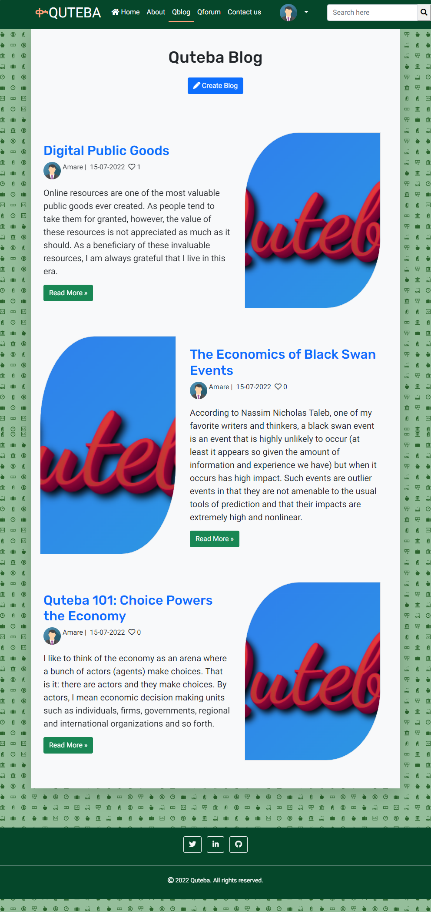
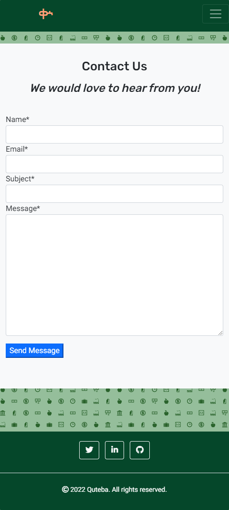
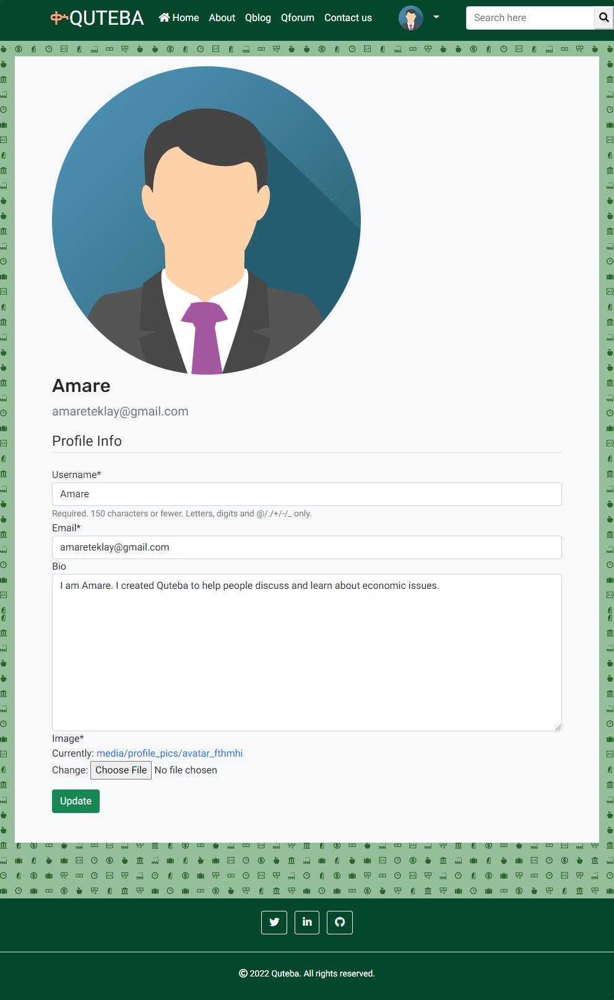
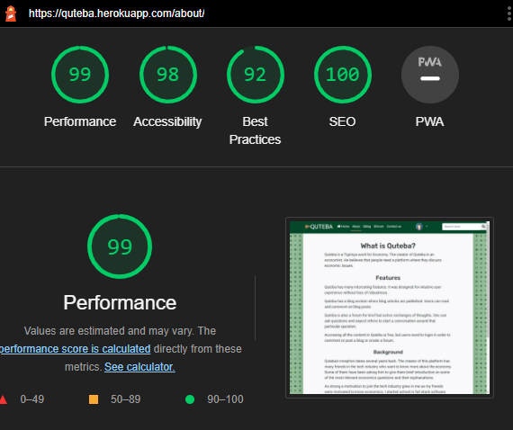
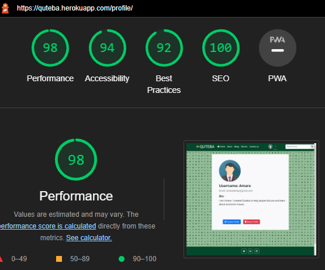
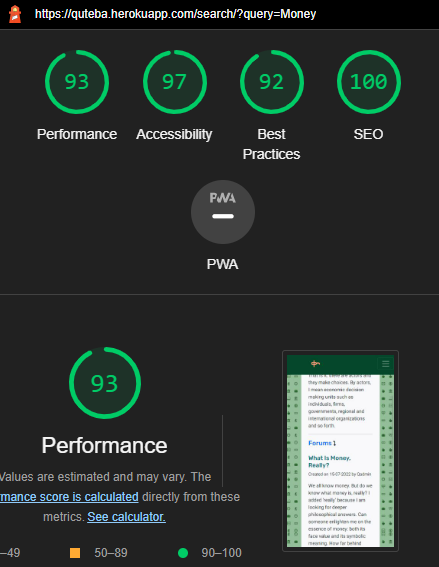

# Testing and Validation

In this file, I document the different testing procedures I followed and validation techniques I used as well as relevant reports. 

I used both manual and automated testing to test the python code. I validated the HTML, JavaScript and CSS code using W3C validator and JSHint. Lighthouse reports and responsive viewer reports are included in this document.

#
## Manual Testing

The following list shows the steps taken to manually check that the different componenets and functionalities work as expected. 

|     | User Actions           | Expected Results | Y/N | Comments    |
|-------------|------------------------|------------------|------|-------------|
|Home page           |  |  |  | 
|1           |Click on the 'Create Account' button  |Redirect to Signup page  |  Y  | 
|2           |Click on the 'Sign in' button  |Redirect to Login page  |  Y   | 
|3           |Click on the 'Qblog' heading  |Jump to Recent Posts section of the home page  |  Y  |  
|4           |Click on the 'Qforum' heading  |Jump to Recent Forums section of the home page  |  Y  | 
|5           |Click on the 'Sign up' links in the Recent Posts and Recent Forums sections  |Redirect to Signup page  |  Y  | 
|6           |Click on the 'Sign in' links in the Recent Posts and Recent Forums sections  |Redirect to Login page  |  Y  | 
|7           |Click on the title of each post  | If user is logged in, open post detail page. Redirect to Login page otherwise.  |  Y  | 
|8           |Click on the title of each forum entry  |If user is logged in, open forum detail page. Redirect to Login page otherwise.  |  Y  |  
| Sign Up     |                        |                  |      |             |
| 1           | Click on Sign Up button | Redirect to Sign Up page | Y |          |
| 2           | Click on the Login link in the form | Redirect to Login page | Y |          |
| 3           | Enter valid email | Field accepts email address format and a unique email | Y |          |
| 4           | Enter valid password  | Field accepts secure passwords | Y |          |
| 5           | Enter the same password in the Password Confirmation | Field accepts password that was used in the previous field | Y |          |
| 6           | Click on the Signup button  | If all fields are correct, redirect to home page | Y |          |
| 7           | If you have an account already, click on the Signin button  | Redirect to Login page | Y |          |
|Login           |  |  |  | 
|1           |Click on the 'Sign in' button in the home page or the Sign in menu item on the menu bar  |Redirect to the Login page  |  Y  | 
|2           |If you don't have an account yet, Click on the 'Sign up' link in the login page  | Redirect to the Sign up page |  Y  | 
|3           |Enter your username in the Username field |Accept only existing username  |   Y |  
|4           |Enter your password in the 'Password' field  |Accept only existing password associated with the username in the previous field  |  Y  | 
|5           |Click on the 'Sign in' button  |Redirect to home page and show success message  |  |  
|Qblog          |  |  |  | 
|1         |If you are logged in as superuser, Click on the 'Create Blog' button  |  |  Y  |
|Create post           |  |  |  | 
|1           |Choose Author | Select Author from a list of registered users  |  Y  | 
|2           |Fill out the title, content and excerpt fields. Status can take Draft as a default value.  |Accept only filled out form. |   Y | 
|3           |Click on Save button   |Redirect to blog list page  |  Y  |  
|Single blog page           |  |  |  | 
|1           |Click on the title of each blog post in the post list page  |Redirect to post detail page  |   Y | 
|2           |Click on the 'Read More' button at the end of each excerpt in the blog list page  |Redirect to post detail page |  Y  | 
|3           |If you are logged in as superuser, click on the 'Edit post' link  |Open post update page with each field prepopulated with the values of the particular post.  |  Y  | 
|4           |Edit the fields you want to update and click on 'Save Changes'  |Save changes in the database and redirect to the post detail page of the post you just updated.  |  Y  |
|5           |Click on the like button (thumbs up icon)  |If not liked previously, Like icon filled solid and number of likes incremented by one. If it had been liked, icon changes to outline fill and likes reduced by one.  |   Y | 
|6           |Type a comment in the text area and click on the Submit button   |Comment saved and comment waiting approval message is displayed, replacing the form.  |  Y  | 
|Qforum           |  |  |  | 
|1           |Click on the 'Create Forum' button  |Create forum modal pops up  |  Y  |
|2           |Choose a category from the list in the category field  |Categories entered by admin shown  |  Y  | 
|3           |Enter topic and description and click on Submit  |Forum entry saved and new forum added at the top of the list of forums in real time  |  Y  |  
|4          |Click on the title of each forum entry  |Redirect to forum detail page  |   Y | 
|5         |Click on the title of each item on the recent topics in the side bar  |Redirect to forum detail page  |  Y  | 
|Thread page (Single forum entry)           |  |  |  | 
|1           |Click on the green upward arrow  |Increment up votes by one. If previously voted down, subtract one from down votes.  |  Y  | 
|2          |Click on the red downward arrow  |Increment down votes by one. If previously voted up, subtract one from up votes.  |  Y  | 
|3          |Click on the 'Comment' button  |Display modal for comment form  |  Y  | 
|4           |If you click on the 'Comment' button, type your comments in the text are that pops up and click on Submit  |Comment saved to databaase and new comment appended to the forum entry  |  Y  |
|5          |If you are the author of the forum entry, Click on the pencil icon  |Open update forum page  |  Y  | 
|6          |Make the changes you want and click on Submit  |Save updates and redirect to forum detail page  |  Y  | 
|7          |If you do not want to change the forum, click on Cancel in the update forum page  |Redirect back to forum detail page  |  Y  | 
|6          |If you are the author of the forum you are reading, click on the delete (trash) icon  |Redirect to Delete Forum page   |  Y  | 
|6          |To confirm deletion, click on the delete button  |Delete forum entry and redirect to forum list page   |  Y  | 
|6          |If you do not want to continue with the deletion, click on Cancel  |Redirect to forum detail page   |  Y  | 
|7           |Click on the like icon (thumbs up symbol)  |Increment likes by one. If disliked, reduce dislikes by one. |  Y  | 
|8           |Click on the dislike icon (thumbs down symbol)  |Increment dislikes by one. If liked, reduce likes by one.  |  Y  | 
|9           |Click on the 'Reply' button  | Visible to a user who is not the author of the comment to reply to. A reply form expands. |  Y  | 
|10          |If you click on the 'Reply' button, type your reply in the text area that expands and click on Submit  |Save reply and show new reply in real time  |  Y  | 
|Navigation bar           |  |  |  | 
|1           |Click on the 'Home' menu item  |Redirect to the Home page  |  Y  | 
|2           |Click on the 'About' menu item  |Redirect to the About page |  Y  | 
|3           |Click on the 'Contact us' menu item  |Redirect to the Contact us page  |  Y  | 
|4           |Click on the 'Qblog' menu item  |Redirect to the Blog list page  |  Y  | 
|5           |Click on the 'Qforum' menu item  |Redirect to the Forum list page  |  Y  | 
|6           |Click on your <username> in the menu bar  |Redirect to the profile page of <username>  |  Y  | 
|7           |Click on the 'Logout' menu item  |Redirect to the Logout page  |  Y  |
|8           |Click on the 'Sign out' button in the Logout page  |Log out user, redirect to the Home page and display success message  |  Y  | 
|9           |Click on the 'Cancel' button in the sign out page  |Redirect to the Home page  |  Y  | 
|Search           |  |  |  | 
|1           |Enter search word in the search form and Click on the search icon to submit |Redirect to the search results page and shows results or feedback that no results were found  |  Y  |  
|Contact page           |  |  |  | 
|1           |Enter your name in the Name field  |Field cannot be empty  |  Y  | 
|2           |Enter your email in the Email field  |Field is required and expects valid email  |  Y  | 
|3           |Enter a subject in the Subject field  |Field is required  |  Y  | 
|4           |Write your message in the Message field  |Field is required  |  Y  | 
|5           |Click on the 'Send Message' button  |Redirect to home page and display thank you message  |  Y  | 
|Profile page           |  |  |  | 
|1           |If you have logged in, click on your <username> in the menu bar  |Open profile page  |  Y  | 
|To update profile           |  |  |  |
|2           |Click on the 'Update Profile' button  |Open the update profile page and prepopulate fields with existing user data  |  Y  |  
|3           |You can edit or change your username in the 'Username' field  |Change is optional  |  Y  | 
|4           |You can edit or change your email in the 'Email' field  |Valid email expected  |  Y  | 
|5           |You can edit or change your bio in the 'Bio' field  |Change is optional  |  Y  | 
|6           |You can click on the 'Choose File' button to upload a new profile image  |Replace profile image with new image  |  Y  | 
|7           |Click on the 'Update' button to save changes  |Save profile updates and redirect to the profile page  |  Y  |
|To delete profile           |  |  |  | 
|1           |Click on the 'Delete Profile' button  |Redirect to delete confirmation page  |  Y  | 
|2           |Click in the 'Confirm Delete' button  |Delete profile and redirect to the home page  |  Y  | 
|3           |Click on the 'Cancel' button  |Redirect to the profile page |   Y |  
 

## Automated Testing
# 
I wrote automated tests to complement the extensive manual testing and validations documented in this report. 

* The automated tests, based on the python unit test framework, cover 54% of the functionalities, and the test report is shown below.

* I used [coverage 6.4.1](https://coverage.readthedocs.io/en/6.4.2/) to generate a report about the coverage of the automated test code. 

## Testing User Stories

User stories are at the core of the whole development process, and the importance of testing whether the user stories have been addressed cannot be overstated. 

The following table maps the user stories and the features that have been developed to address them. These can be thought of as part of the foregoing manual testing.

|User Stories     |Acceptance Criteria met? (Y/N)             | Features    |
|-------------|------------------------|-------------------------------|
|As a first time visitor I want to get information about the site so that I can understand the what the site focuses on and how I can make the best out of it.           | Y  | [About page](assets/screenshots/about-page.png)|
|As a first time visitor, I want to be able to navigate the site so that I can find the most important information with the least amount of effort.            | Y   | Navbar and Qblog and Qforum links |
|As an engaged user, I want to see relevant feedback so that I can understand if my interactions with the site are successful or not.           | Y  | |
|As a user, I want to know which menu item is active so that I can know which part of the site I am navigating at each moment.     |  Y  |  |
| As a user, I want to be able to access quteba's contents and functionalities from my mobile or tablet so that I do not have to wait until I find a computer.  |  Y | [Responsive design](#responsiveness)   |
| As a frequent user, I want to follow the site owner on social media so that I can see recent activities and updates from my favourite social media apps.  |  Y  | [Social links in Footer](assets/screenshots/footer.png)  |
| As a first time visitor I want to sign up so that I can have login credentials which I can use to login to the site every time I want to use it. | Y | Signup page |
| As a registered user, I want to be able to login with my registereg credentials so that I can access my profile as well as all the contents and functionalities that require that users be logged in. | Y | Login page |
| As a logged in user, I want to be able to logout easily so that I feel safe that others do not interact with the site via my account. |Y  | Logout menu item |
| As a registered user I want to have a profile so that I can choose a profile picture and share my bio with other quteba users. |  Y| Profile page |
| As a registered user I want to update and delete my profile so that I have control of what I want to do with my personal information. | Y | Update and Delete profile |
| As a reader I want to read excerpts of blog posts so that I choose which articles to read without going through the whole content of each post. | Y | Blog list page and home page |
| As a contributor I can create drafts and publish posts without entering the admin page so that I can quickly share my views and analyses with readers. | Y | Create post page |
| As a regular reader, I want to read the contents of each post on its own page so that I can focus on the contents of the specific post at a time while being able to see other users' feedbacks to the particular post. | Y | Post detail page |
| As a registered user I want to like posts and add comments so that I can express my impression and engage in a discussion. | Y | Like post, Comment on post |
| As a first time visitor I want to see sample forum entries so that I can decide if I want to join the discussions. | Y | Recent forum section in home page, Forum list page |
| As a registered user, I want to create a discussion forum so that I can get answers to my questions and start conversations. | Y | [Create forum form](assets/screenshots/create-forum.png) |
|As a user, I want update or delete my own discussion forum so that I can opt out from a conversation that takes a different direction from I initially intended. | Y | Update and Delete forum buttons |
| As a frequent user, I want to vote up or vote down a forum so that I can quickly reward or punish contents based on their importance and relevance without having to write comments. | Y | Green up and Red down arrows |
| As a dedicated user, I want to reply to comments on a forum I created so that I can open and lead an engaging conversation on relevant topics. | Y |Reply button and form |
| As a registered user, I want to leave comments on discussion forums so that I can express my views and lead to further discussions. | Y |Comment button and form  |
| As a frequent user, I want to like or unlike comments and replies to express my opinions of them without having to write comments or replies. | Y | Like and Dislike buttons |
| As a registered user, I want to reply to other users' comments and replies so that I can follow the threads and identify the forkroads that emerge from the discussions. | Y | Nested reply |
| As a forum reader, I want to see nested threads of forum topics, comments and replies so that I can visually see which replies are given to which comment. | Y | Forum detail page |
| As a user, I want to search for specific content so that I can find quick answers to the questions I have in mind. | Y |  |
| As a user, I want to see excerpts of my search results so that I can quickly identify the most relevant content I want to read further. |Y  | Search results page |
| As a user, I want to interact with the site smoothly so that I can see the effect of my actions without refreshing the pages. | Y | Ajax calls to show changes in real time |
| As a user I want to contact the site admin directly so that I can ask questions and send comments to get clarifications and to express my opinions and expectations. |  Y| Contact us page |
|    |  |  |

## Validation
#

### **Python Validation**

I used [pep8 online checker](http://pep8online.com/) to validate all python code. I have compiled a PDF file for the whole pep8 validation report available [here](/assets/testing/pep8_validation.pdf).

I have also organized the validation reports by app name and in each app by the particular python file. Under each app are the python files in that app that were checked for pep8 compatibility.

* **Home app**
    - [Home app-py](/assets/testing/home-app.png)
    - [Home admin-py](/assets/testing/home-admin.png)
    - [Home forms-py](/assets/testing/home-forms.png)

    - The validation report of the models-py file is displayed as a sample.

    
    
    - [Home urls-py](/assets/testing/home-urls.png)
    - [Home views-py](/assets/testing/home-views.png)

* **Qblog**
    - [Qblog app-py](/assets/testing/qblog-app.png)
    - [Qblog admin-py](/assets/testing/qblog-admin.png)
    - [Qblog forms-py](/assets/testing/qblog-forms.png)
    - [Qblog models-py](/assets/testing/qblog-models.png)
    - [Qblog urls-py](/assets/testing/qblog-urls.png)

    - The validation report of the views-py file in the Qblog app is displayed as a sample.

    

* **Qforum**
    - [Qforum app-py](/assets/testing/qforum-app.png)
    - [Qforum admin-py](/assets/testing/qforum-admin.png)
    - [Qforum forms-py](/assets/testing/qforum-forms.png)

    - The validation report of the models-py file in the Qforum app is displayed as a sample.

    

    - [Qforum urls-py](/assets/testing/qforum-urls.png)
    - [Qforum views-py](/assets/testing/qforum-views.png)

* **Quteba**
    - [Quteba app-py](/assets/testing/quteba-asgi.png)
    - [Quteba admin-py](/assets/testing/quteba-settings.png)
    - [Quteba forms-py](/assets/testing/quteba-urls.png)
    - [Quteba models-py](/assets/testing/quteba-views.png)
    
    - The validation of the project level urls-py file is displayed as a sample.

    

* **Users**
    - [Users app-py](/assets/testing/users-app.png)
    - [Users admin-py](/assets/testing/users-admin.png)
    
    - The validation report of the forms-py file in the users app is displayed as a sample.

    

    - [Users models-py](/assets/testing/users-models.png)
    - [Users urls-py](/assets/testing/users-urls.png)
    - [Users views-py](/assets/testing/users-views.png)

Here are the validation reports of the testing code files as well.
* **Testing**

    

    

    

    

### **HTML Validation**

I validated the HTML code for this website using the [W3C Markup validator](https://validator.w3.org/), and I have only one error that comes from the django-allauth. The validation of HTML templates that include template tags is not straightforward. 

I used the chrome developer tools to view the source code for the rendered pages, copied the source code and pasted it in the validator. 

In many cases, the source code pulls different components, which may introduce validation errors, as in the sign up form from django-allauth below. 

* The validation report of the signup HTML file from Django-allauth shows one error.

* There are no other errors in the HTML validation reports. I have compiled the reports in PDF in this [HTML validation report](/assets/testing/html_validation.pdf).

* Here is the home page HTML validation report as a sample.

### **JavaScript Validation**

- [JSHint](https://jshint.com/) was used to validate the JavaScript code, and no errors or warnings were found. Below are screenshots of the reports.

- JSHint Validation of JavaScript code for forum app

- JSHint Validation of the main JavaScript code

### **CSS Validation**

* I validated the CSS code for the website using the [Jigsaw W3C CSS Validator](https://jigsaw.w3.org/css-validator/). 
* There are no errors or warnings in both base and forum CSS files.

* CSS validation for base CSS file

* CSS validation for forum CSS file

## Responsiveness

* I used the [Responsive Viewer](https://chrome.google.com/webstore/detail/responsive-viewer/inmopeiepgfljkpkidclfgbgbmfcennb?hl=en) Chrome extension to check the website on devices with different screen sizes.

* As documented in the following table, all pages are highly responsive to different screen sizes. 

| Page    | On Mobile             | On Tablet   |On Laptop | On Desktop |
|-----------|------------|----------|---------|-------|
| About|  |  |  | |
| Blog|  |  |  | |
| Blog detail|  |  |  | |
| Contact|  |  |  | |
| Forum|  |  |  | |
| Forum detail|  |  |  | |
| Home|  |  |  | |
| Login|  |  |  | |
| Profile|  |  |  | |
| Update Profile|  |  |  | |
| Delete Profile|  |  |  |  |
| Search|  |  |  | |
| Sign up|  |  |  | |

## Lighthouse Test

* The lighthouse test indicators of both mobile and desktop versions of almost all pages are really high. 

* The use of avatars as profile pictures of users has some effect on these metrics in pages like profile and forum list. The overall performance, accessibility, adherence to best practices and SEO measures of the website are excellent.

| Page    | On Mobile  | On Desktop |
|---------|------------|----------|
| About|  | |
| Blog|  | |
| Blog detail|  | |
| Contact|  | |
| Forum|  | |
| Forum detail|  | |
| Home|  | |
| Login|  | |
| Profile|  | |
| Search|  | |
| Signup|  | |

#
# [Back to Top](#testing-and-validation)

#